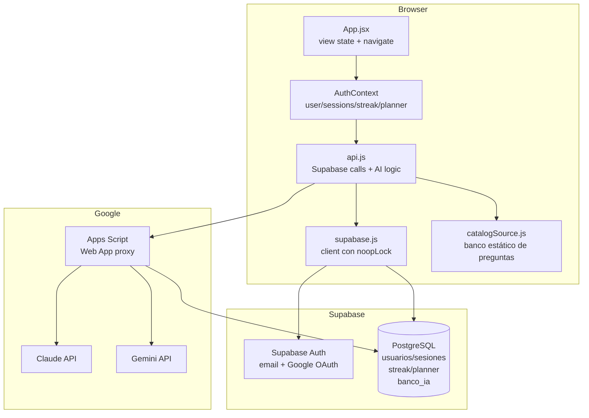
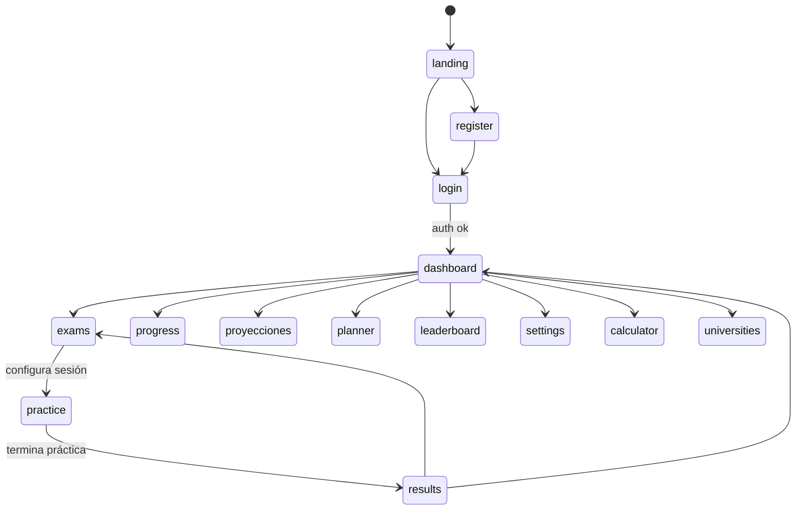
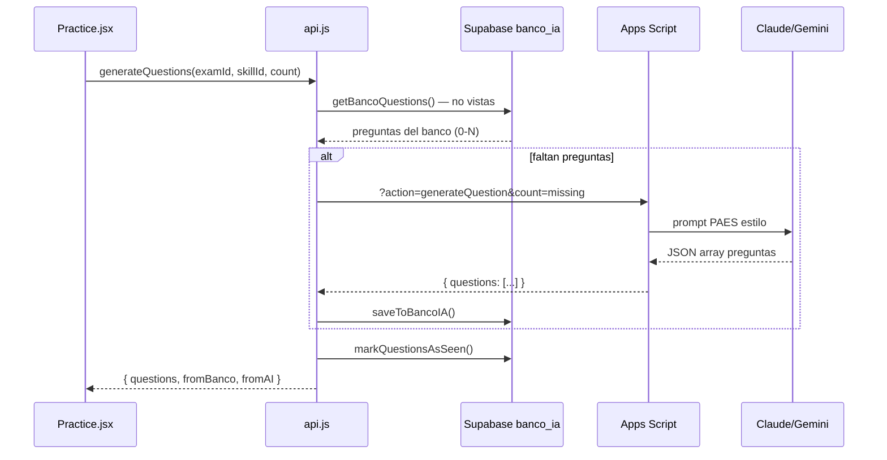
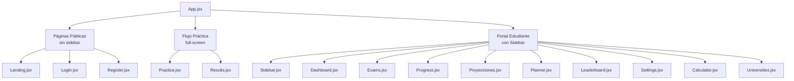

# Diagramas de Arquitectura — paes-app-codex

> Renderizar con VS Code (extensión Markdown Preview Mermaid Support), GitHub, o Obsidian.

---

## 1. Arquitectura General



---

## 2. Flujo de Navegación (sin React Router)



---

## 3. Esquema de Base de Datos (Supabase)

```mermaid
erDiagram
    usuarios {
        text email PK
        text name
        text picture
        text school
        text grade_level
        int target_score
        jsonb targets
        text anio_nacimiento
        text situacion
        text region
        text colegio_id
        timestamptz created_at
        timestamptz last_login
    }
    sesiones {
        text id PK
        text user_email FK
        text exam_id
        text mode
        int correct
        int total
        int score
        timestamptz date
    }
    streak {
        text user_email PK_FK
        int current
        int best
        int total_days
        text last_activity
        jsonb history
    }
    planner {
        text user_email PK_FK
        text week_id
        text plan_id
        jsonb progress
        timestamptz updated_at
    }
    banco_ia {
        text id PK
        text exam_id
        text skill_id
        text text
        jsonb options
        int correct
        text explanation
        text generado_por
        int veces_usada
    }
    preguntas_vistas {
        text user_email FK
        text question_id FK
        text exam_id
        text skill_id
        bool fue_correcta
    }
    colegios {
        text id PK
        text nombre
        text comuna
        text tipo
        text region
    }

    usuarios ||--o{ sesiones : "user_email"
    usuarios ||--o| streak : "user_email"
    usuarios ||--o| planner : "user_email"
    usuarios ||--o{ preguntas_vistas : "user_email"
    banco_ia ||--o{ preguntas_vistas : "question_id"
```

---

## 4. Flujo de Generación de Preguntas IA



---

## 5. AuthContext — Estado Global

```mermaid
graph LR
    AC[AuthContext]

    AC -->|expone| U[user<br/>email, name, picture<br/>school, targets]
    AC -->|expone| S[sessions[]<br/>historial de práctica]
    AC -->|expone| ST[streak<br/>current, best, totalDays]
    AC -->|expone| PL[planner<br/>weekId, planId, progress]
    AC -->|expone| LB[leaderboard[]]
    AC -->|computed| PS[progressStats<br/>por examen: attempted/correct/trend]
    AC -->|computed| RA[recentActivity<br/>últimas 5 sesiones]

    AC -->|métodos| M1[login / logout / register]
    AC -->|métodos| M2[saveSession]
    AC -->|métodos| M3[updateProfile]
    AC -->|métodos| M4[savePlannerProgress]
    AC -->|métodos| M5[fetchLeaderboard]
```

---

## 6. Estructura de Componentes por Página


